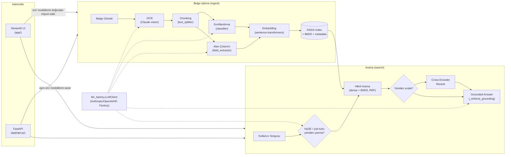

# DocuRAG


   

Belge görsellerinden (fatura, sözleşme, dilekçe vb.) çıkarılan metinler üzerinde hibrit (BM25+dense) semantik arama, LLM tabanlı sınıflandırma/alan çıkarımı ve kaynak gösterimli (grounded) cevaplama yapabilen, çoklu dil modeli (cloud/local) desteğine uygun esnek bir RAG (Retrieval-Augmented Generation) pipeline'ı.

> 🚧 **Durum: Geliştirme aşamasında.** Aşağıdaki modüller tamamlanmış olup proje aktif olarak genişletilmektedir. Kapsamlı bir genişletme turu sonrası güncel test/coverage sayıları için üstteki rozetlere bakın (rozetler statik; CI'ın "tests" rozeti güncel durumu otomatik gösterir).

## Mimari



Streamlit (`app/`) ve FastAPI (`app/api.py`) **birbirine bağımlı değildir** — ikisi de `src/` katmanındaki aynı fonksiyonları (paralel, bağımsız) sarar. FastAPI eklenirken Streamlit'in mevcut mimarisine (doğrudan `src/` import) hiç dokunulmadı; bu, `python -m uvicorn app.api:app --reload` ile bağımsız çalıştırılabilir, otomatik `/docs` (Swagger) dokümantasyonu üretir.

## Şu ana kadar tamamlananlar

- **Multimodal OCR** — Belge görselleri, klasik OCR yerine multimodal bir LLM'e verilerek yapılandırılmış (JSON) metin ve meta veri çıkarımı yapılıyor.
- **Text Splitter** — Framework kullanmadan yazılmış, paragraf → satır → cümle → kelime hiyerarşisini izleyen token bazlı recursive chunking fonksiyonu.
- **Embedding Üretimi** — Çok dilli (Türkçe destekli) `sentence-transformers` modeliyle chunk'lar vektörleştiriliyor.
- **Vektör Veritabanı** — Embedding'ler FAISS'e (`IndexFlatIP`, kosinüs benzerliği) kaydediliyor; doğal dil sorgularıyla en yakın sonuçları (Top-K) döndüren semantik arama fonksiyonu yazıldı.
- **Doğruluk Testi** — Gerçek OCR çıktıları ve ground-truth veri seti üzerinden uçtan uca arama doğruluğu ölçüldü (bkz. `data/processed/search_accuracy_report.json`).
- **Otomatik Belge Sınıflandırma** — Belge metni bir LLM'e (Claude) verilerek önceden tanımlanmış sınıflardan (fatura/sözleşme/dilekçe/talep formu vb.) uygun olan birden fazlasına (multi-label) atanıyor ve serbest metinli etiketler çıkarılıyor. Ayrı bir "belirsiz" kategorisi açmak yerine, güven skoru bir eşiğin altında kalan belgeler `human_review: true` olarak işaretleniyor. Eşik değeri (0.7), 15 belgelik (5 gerçek belge + 10 senaryolu kalibrasyon örneği: net/çoklu-sınıf/fallback "diğer"/kasıtlı belirsiz/hasarlı-taranmış) gerçek API sonucuyla kalibre edildi — net ve belirsiz örnekler arasında 0.41-0.84 bandında hiç örnek çıkmıyor, yani eşik keyfi değil, ölçülmüş bir boşluğun ortasına oturuyor; gerçek çoklu-sınıf (multi-label) çıktısı da iki ayrı kombinasyonla canlı API ile doğrulandı (bkz. `src/classifier.py`, `data/processed/classification_report.json`, `data/processed/classification_calibration_report.json`, `notebooks/08_document_classification_test.ipynb`).
- **Sınıflandırma Meta Verisinin RAG'a Entegrasyonu** — `siniflar`/`guven`/`etiketler`/`human_review` alanları her chunk'a eklenerek FAISS metadata'sının bir parçası haline getirildi; arama sonuçları artık kategori/etiket/inceleme durumuna göre filtrelenebiliyor. Aynı test belgeleri ve sorgularla uçtan uca zincirin (OCR → RAG → Sınıflandırma) doğruluğu bozulmadan korunduğu doğrulandı. İnsan incelemesi sonrası kategori/etiket düzeltmeleri, FAISS index'i (vektörleri) yeniden kurmadan sadece metadata dosyası güncellenerek kalıcı hale getirilebiliyor (bkz. `src/vector_store.py`, `notebooks/09_classification_metadata_rag.ipynb`).
- **LLM Factory ile Çoklu Model (Cloud/Local) Yönetimi** — `config/settings.yaml`'daki `llm_settings.active_mode` (cloud/local) ve `provider` (anthropic/openai/huggingface) değerlerine göre doğru istemciyi kuran ortak bir `LLMClient` arayüzü ve `get_llm_client()` Factory fonksiyonu yazıldı (Gün 1 tasarım, bkz. `notebooks/10_llm_factory_test.ipynb`). Cloud (Anthropic/OpenAI, örn. `gpt_4`) ve local (huggingface, örn. `local_llama`) bağlantılarının ikisi de gerçek çalışır durumda; local tarafı `transformers` ile modeli/tokenizer'ı yükleyip inference çalıştırıyor, `embedder.py`'deki model önbellekleme deseniyle tutarlı şekilde tekrar tekrar yeniden yüklenmiyor. `src/classifier.py`, doğrudan Anthropic SDK'sını çağırmak yerine bu Factory'yi kullanacak şekilde entegre edildi; böylece `config/settings.yaml`'da tek bir değer değiştirilerek `classifier.py`'nin kodu hiç dokunulmadan cloud/local arasında geçiş yapılabiliyor (bkz. `src/llm_factory.py`, `notebooks/11_llm_factory_cloud_local_integration_test.ipynb`).
- **Model Geçişlerinin Loglanması ve Uçtan Uca Test Edilmesi** — Her `LLMClient.generate()` çağrısı (hangi sağlayıcı/model, süre, başarı/hata) standart `logging` modülüyle (`llm_factory` logger'ı) loglanıyor; hata durumunda da traceback ile birlikte kaydediliyor. OCR → RAG → Sınıflandırma zinciri, gerçek OCR verisiyle hem cloud (Anthropic) hem local (huggingface) konfigürasyonuyla uçtan uca çalıştırılıp sonuçlar `data/processed/multi_model_chain_report.json`'a kaydedildi: RAG tarafı (embedding/arama) her iki konfigürasyonda da sorunsuz çalıştı; local tarafta küçük bir modelle (`Qwen2.5-0.5B-Instruct`) JSON formatı korunsa da sınıflandırma doğruluğunun cloud'a göre belirgin şekilde düştüğü gözlemlendi (bkz. `notebooks/12_multi_model_e2e_chain_test.ipynb`).
- **Uçtan Uca Pipeline ve OCR'ın `src/`'e Taşınması** — Notebook 01'deki doğrudan Anthropic vision çağrısı `src/ocr.py`'ye taşındı (retry/backoff ve loglama eklendi); `src/pipeline.py`, OCR → chunking → sınıflandırma → embedding → FAISS indeksleme zincirini `python src/pipeline.py ingest <gorsel>` / `search "<sorgu>"` ile tek komutla çalıştırılabilir hale getiriyor (bkz. DOC-31).
- **Hata Toleransı (Retry) ve Determinizm** — `LLMClient.generate()` gecici hatalarda (ağ, rate limit) üstel geri çekilmeyle otomatik yeniden dener; `classifier.classify_document()` LLM geçersiz JSON dönerse modelden düzeltmesini isteyerek yeniden dener ve varsayılan olarak `temperature=0.0` ile deterministik çalışır (aynı belge tekrar çalıştırıldığında aynı sonucu üretir).
- **FAISS CRUD** — `vector_store.py`, `IndexIDMap` kullanacak şekilde yeniden yazıldı: `add_chunks()` var olan index'i sıfırdan kurmadan genişletir, `delete_by_source_doc()` bir belgeye ait vektörleri index'i yeniden kurmadan siler. Eski (düz `IndexFlatIP` + liste metadata) formatında kaydedilmiş index'ler `load_index()` tarafından otomatik olarak bu id-tabanlı formata göçürülür.
- **Otomatik Test Paketi (pytest) ve CI** — `tests/` altında `text_splitter`, `embedder`, `vector_store`, `classifier`, `llm_factory`, `ocr`, `answer` ve `components` için sahte (fake/mock) istemcilerle çalışan, gerçek API/ağ çağrısı yapmayan 91 test yazıldı; `.github/workflows/tests.yml` her push/PR'da bunları otomatik çalıştırıyor (bkz. `requirements-dev.txt`, `pytest.ini`).
- **Streamlit Arayüzü** — Onaylanan tasarıma (krem/mürekkep/petrol yeşili/bronz "sessiz lüks" paleti, "Onay Damgası" güven rozeti) sadık, 4 sayfalı (Arama, Belge Yükleme, İnceleme Kuyruğu, Dashboard) çalışan bir Streamlit uygulaması (`app/`) yazıldı. Tüm sayfalar gerçek veriyle çalışır — mockup'taki hiçbir sahte sayı yok; Dashboard'da henüz izlenmeyen metrikler (haftalık hacim, model maliyeti/gecikme geçmişi) bilerek eklenmedi, bunlar için zaman damgası/maliyet kaydı altyapısı (bkz. aşağıdaki DOC-30 Öncelik 2/3) gerekiyor.
- **Kaynak Gösterimli Cevaplama (Grounded Answering)** — `src/answer.py`, arama sonuçlarından `[1]`/`[2]` gibi tıklanabilir kaynak numaralarıyla işaretlenmiş bir AI özeti üretiyor. Grounding (kaynaklanma) zorunluluğu prompt'a değil backend'e dayanıyor: modelin döndürdüğü her cümle, geçerli bir kaynak indeksine sahip olduğu koddan doğrulanmadan kabul edilmiyor (bkz. `_enforce_grounding`). Arama sayfasında bir kaynağa tıklamak ilgili sonuç kartını kalıcı olarak vurguluyor (sorgu `st.query_params` ile URL'e senkron tutulduğu için tıklamanın tetiklediği tam sayfa yenilemesinde arama durumu korunuyor). Gerçek API ile uçtan uca doğrulandı.

### Genişletilmiş özellik seti (retrieval, belge zekası, UX)

- **Hibrit Arama (Dense + BM25)** — `src/retrieval.py`, FAISS (dense/anlamsal) ile BM25 (anahtar kelime) sıralamalarını Reciprocal Rank Fusion (RRF) ile birleştiriyor; varsayılan olarak açık (`pipeline.search_documents(use_hybrid=True)`). İlk doğruluk testinde (5 belge, tek kategori, bkz. `data/processed/search_accuracy_report.json`) MRR **0.867 → 0.900**'e çıkmıştı; **bu küçük/homojen örneklemin iyimser olduğu sonradan 15 belge/5 kategoriye çıkarılan bir testle doğrulandı — bkz. aşağıdaki "Uzman incelemesi sonrası eklenenler" bölümü ve `notebooks/14`.** Bilinen sınır: BM25 tarafı Türkçe'nin sondan eklemeli yapısına karşı kök/lemma normalizasyonu yapmıyor (sadece küçük harf + noktalama temizliği).
- **Yeniden Sıralama (Cross-Encoder Rerank)** — `retrieval.rerank()`, mMARCO üzerinde eğitilmiş çok dilli bir cross-encoder (`cross-encoder/mmarco-mMiniLMv2-L12-H384-v1`) ile ilk aday listesini yeniden sıralıyor. `sentence-transformers.CrossEncoder` sarmalayıcısı bu modelle (gerçek API ile test edilirken bulunan bir uyumsuzluk nedeniyle) çalışmadığı için, `llm_factory.LocalHFClient` ile aynı desende doğrudan `transformers` Auto sınıfları kullanılıyor. Varsayılan kapalı (demo akıcılığı için), arama sayfasında bir onay kutusuyla açılır.
- **Sorgu Genişletme (HyDE) ve Çok-Turlu Arama** — `src/query_rewriter.py`: `generate_hypothetical_answer()` kısa/belirsiz sorguları bir LLM ile üretilen varsayımsal cevapla zenginleştirir (embed edilen metin genişler, orijinal sorgu ve nihai cevap değişmez); `condense_conversation()` önceki soru geçmişini kullanarak takip sorularını ("peki tarihi neydi?") bağımsız bir sorguya yoğunlaştırır. Her ikisi de nihai cevabı `answer.generate_grounded_answer()`'a bırakır — grounding zinciri bozulmaz.
- **Yapılandırılmış Alan Çıkarımı ve Filtreli Sorgu** — `src/field_extractor.py`, OCR metninden tarih/tutar/taraflar/belge no/konu alanlarını LLM ile çıkarıp chunk metadata'sına ekliyor; `vector_store.search()`'e eklenen `metadata_filter` parametresiyle (varsayılan `None`, eski davranış korunur) "tutarı 1000-5000 TL arası olan belgeler" gibi filtreli aramalar mümkün. Arama sayfasındaki "Gelişmiş filtre" bölümünden kullanılabilir.
- **Anomali Tespiti ve Belge İlişki Grafiği** — `src/anomaly.py` (tekrarlanan belge numaraları, tutar aykırı değerleri — basit z-skoru, en az 5 örnek şartı) ve `src/graph_builder.py` (ortak taraf paylaşan belgeler arası ilişki grafiği) tamamen kod-tabanlı, **LLM çağırmaz**. Grafik, yeni bir JS kütüphanesi eklenmeden `networkx.spring_layout` (sabit `seed=42`, deterministik) + elle üretilmiş inline SVG ile render ediliyor (bkz. `components.render_document_graph_svg`, mevcut donut grafik deseniyle tutarlı).
- **Görsel Vurgulama** — Bir kaynağa tıklandığında, arama sayfası kaynağın belge görseli üzerindeki yaklaşık konumunu kutuyla işaretler. Claude vision'dan doğrudan koordinat İSTENMEDİ (halüsinasyon riski + kod tarafında doğrulanamazlık, "grounding kodda doğrulanır" ilkesini ihlal eder); bunun yerine Tesseract, opsiyonel/lazy (sadece tıklama anında çalışan) bir "geometri sidecar'ı" olarak kullanılıyor (`ocr.extract_word_boxes`/`locate_chunk_bbox`, bulanık kelime eşleştirmesiyle). **Operasyonel sınır:** Tesseract-OCR sistem düzeyinde bir binary + `tur.traineddata` gerektirir (pip paketi yetmez); kurulu değilse özellik sessizce devre dışı kalır, ana pipeline hiçbir şekilde etkilenmez (bu makinede doğrulandı).
- **Toplu Yükleme, Kademeli Cevap Gösterimi, Dışa Aktarma** — Belge Yükleme sayfası artık çoklu dosya kabul ediyor ve elle yazılmış adım tekrarı yerine `pipeline.ingest_document(on_step=...)` callback'ini kullanıyor (kod tekrarı kapatıldı). Arama sayfasındaki özet, `_enforce_grounding`'den geçmiş (zaten doğrulanmış) cümleleri kademeli gösteriyor — **bu gerçek bir token-stream değil**, sadece okuma deneyimini yumuşatan algısal bir gösterim (gerçek gecikme kazancı yok). Arama sonuçları CSV, Dashboard ise yazdırılabilir bir HTML rapor (`-webkit-print-color-adjust: exact` ile) olarak indirilebiliyor.
- **Gerçek Maliyet/Gecikme Takibi** — `llm_factory.LLMClient.generate()`, her başarılı çağrıdan sonra token kullanımını (sağlayıcının `usage` alanından) ve süreyi `data/processed/usage_log.jsonl`'a (append-only) kaydediyor; küçük, elle bakımlı bir fiyat tablosundan (bilinmeyen modeller için `None`, sahte maliyet uydurulmaz) tahmini USD maliyeti hesaplanıyor. Dashboard'da gerçek verilerle dolan bir panel var.
- **Ayarlar Sayfası, Belge Silme, "Tüm Belgeler" Envanteri, İnceleme Kuyruğu'nda Görsel/OCR Metni** — LLM modu/sağlayıcısı artık UI'dan değiştirilebiliyor (`config/settings.local.yaml` — yorumlu `settings.yaml`'a asla dokunmayan, ayrı bir override dosyası; yeniden başlatma gerekmiyor). `vector_store.delete_by_source_doc()` (önceden hazır ama UI'da hiç kullanılmıyordu) artık İnceleme Kuyruğu ve Tüm Belgeler sayfalarından erişilebiliyor. İnceleme Kuyruğu artık belgenin görselini ve OCR ham metnini gösteriyor (önceden kişi belgeyi görmeden kategori onaylıyordu).
- **Ayrı, Ek Bir REST Servisi (FastAPI)** — `app/api.py`, Streamlit'e dokunmadan aynı `src/` fonksiyonlarını (`ingest_document`, `search_documents`, `delete_by_source_doc`, envanter) sarıyor; `/documents`, `/search`, `/documents/{source_doc}` endpoint'leri ve otomatik `/docs` (OpenAPI/Swagger) dokümantasyonu var.
- **Ortak JSON Ayrıştırma Yardımcısı** — `classifier.py` ve `answer.py`'de birebir kopya olan JSON-ayrıştırma/yeniden-deneme mantığı (`_extract_json`/`_generate_and_parse_json`), `field_extractor.py` ile üçüncü bir kopya açılmadan önce `src/llm_json_utils.py`'ye çıkarıldı; davranış korunarak kod tekrarı kapatıldı.
- **Bento Grid Tasarımı (Dashboard, Tüm Belgeler)** — Bu iki sayfa, önceki düz ("her kart aynı boyut/renk") kart deseninden bilinçli bir sapmayla farklı boyutlarda kutulardan oluşan bir bento grid'e dönüştürüldü: Dashboard'da bir petrol-yeşili ve bir bronz "hero" kutusu (toplam belge sayısı, aktif LLM modu) gözü ilk çeken vurguları taşırken, geri kalan KPI/donut/aktivite/maliyet panelleri düzenli bir 4 sütunlu grid'de yer alıyor. Tüm Belgeler sayfasında en son işlenen belge tam genişlikte bir "hero" kart, geri kalanı 3 sütunlu bir kart ızgarası. Renk token'ları (`--accent`, `--bronze` vb.) korunuyor — değişen marka paleti değil, düzen/tipografi. Native Streamlit widget'larının (buton, popover) ham HTML grid'lere güvenilir şekilde gömülemediği bulunduğu için Dashboard tamamen tek bir HTML bloğu, Tüm Belgeler ise `st.container(border=True)` + renk-bloklu "banner" div deseniyle inşa edildi (bkz. `app/styles.py` `.bento-*` sınıfları). `streamlit.testing.v1.AppTest` ile (tarayıcı olmadan) her iki sayfa da gerçek üretim verisiyle uçtan uca render edilip hatasız çalıştığı doğrulandı; bu doğrulama sırasında `render_class_distribution_donut()`'un çok satırlı HTML çıktısının (baştaki boş satır yüzünden) başka bir HTML bloğunun ortasına gömüldüğünde Markdown'u erken kapattığı gerçek bir hata bulunup düzeltildi (`.strip()`).

### Uzman incelemesi sonrası eklenenler (DOC-34)

Dört bağımsız uzman gözünden (RAG mimarisi, LLM mühendisliği, yazılım/MLOps olgunluğu, UX/sunum etkisi) yapılan bir eleştiri turu sonrası eklenen, hepsi gerçek API/gerçek test ile doğrulanmış maddeler:

- **Structured Output (tool_use) geçişi** — `classifier.py`/`field_extractor.py`/`answer.py`, JSON'u artık prompt talimatı + regex/retry ile değil, `LLMClient.generate_structured()` üzerinden zorluyor: `AnthropicClient`/`OpenAIClient` gerçek `tool_use`/function-calling ile şemayı **API seviyesinde** garanti ediyor (`src/llm_factory.py`); yalnızca `LocalHFClient` (transformers'ın böyle bir API'si olmadığından) eski "JSON iste, bozuksa düzelt" desenine düşüyor — bu fallback taban sınıfta (`LLMClient.generate_structured`) tek yerde tanımlı, `FakeLLMClient` de dahil hiçbir mevcut test bozulmadı. Gerçek API ile doğrulandı: normal bir sınıflandırma artık **tek** API çağrısında (retry'sız) sonuçlanıyor (bkz. `notebooks/13`).
- **Prompt Injection Savunması** — OCR'dan gelen belge metni (GÜVENİLMEZ) artık `wrap_untrusted()` ile `<belge_icerigi>` etiketleri içine alınıyor, sistem promptlarına `UNTRUSTED_CONTENT_NOTICE` ekleniyor (bkz. `src/llm_json_utils.py`). **6 farklı gerçek API saldırı denemesiyle** (talimat geçersiz kılma, sahte "gizli talimat" ile kategori/tutar ele geçirme, sistem promptu sızdırma, kaynak içine gömülü talimat) test edildi — **6/6'sı başarısız oldu**, model bir denemede bunu gerekçesinde açıkça belirtti (bkz. `notebooks/13_structured_output_and_injection_test.ipynb`, `data/processed/prompt_injection_report.json`). Bilinen sınır: bu prompt-tabanlı bir savunma, kod tarafında matematiksel olarak garanti edilemez — `classifier.py`'deki sınıf allowlist doğrulaması buna ek, kod-seviyeli ikinci bir katman sağlıyor.
- **Few-Shot Geri Besleme (dış-uygun aktif öğrenme)** — İnceleme Kuyruğu'nda bir insan bir sınıflandırmayı düzelttiğinde (`app/views/review.py`), düzeltme `data/processed/human_corrections.jsonl`'a kaydediliyor (`classifier.record_correction`); `classify_document(use_few_shot=True)` en son birkaç düzeltmeyi sistem promptuna örnek olarak ekleyebiliyor. Model ağırlıklarını değiştirmiyor (gerçek fine-tune değil, in-context öğrenme) — varsayılan kapalı.
- **Genişletilmiş Değerlendirme Örneklemi ve RAG Otomatik Değerlendirmesi** — Arama doğruluk testi **5 belge/1 kategoriden → 15 belge/5 kategoriye** (fatura, sözleşme, dilekçe, talep formu) çıkarıldı, AYRI bir `data/processed/eval_index.*` kullanılarak (production index'e dokunulmadı). Sonuç dürüst ve önemli: **Hit@1 %80→%67, MRR 0.900→0.761**'e düştü — küçük/homojen örneklem gerçekten iyimserdi, bu bir regresyon değil daha gerçekçi bir ölçüm. Ayrıca hafif, framework-bağımsız bir **LLM-as-judge (RAGAS-tarzı) harness'i** eklendi: ortalama **faithfulness 0.96** (üretilen cevaplar kaynaklarıyla semantik olarak da tutarlı, sadece index-geçerli değil), ama **grounded_rate %83** (12 sorgunun 2'sinde retrieval doğru belgeyi getiremedi ve sistem — uydurmak yerine — hiç cevap üretmedi). Zayıf halkanın generation değil retrieval olduğu sayısal olarak doğrulandı (bkz. `notebooks/14_expanded_search_accuracy_test.ipynb`, `data/processed/rag_eval_report.json`).
- **Dosya Kilidi (filelock)** — `vector_store.save_index()`/`save_metadata()`/`load_index()` artık `{path}.lock` üzerinden `filelock.FileLock` ile korunuyor; README'de "bilinen sınır" olarak belgelenen FastAPI+Streamlit eşzamanlı yazma riski artık sessizce veri kaybına değil, anlamlı bir `RuntimeError`'a çıkıyor.
- **Prometheus `/metrics`** — `requirements.txt`'de kurulu ama kullanılmayan `prometheus_client` artık gerçekten kullanılıyor: `app/api.py`'ye `docurag_api_requests_total`/`docurag_api_request_duration_seconds` (route-pattern bazlı, cardinality kontrollü) eklendi.
- **CI'a ruff + mypy** — `.github/workflows/tests.yml`, testlerden önce `ruff check` ve `mypy` çalıştırıyor (`ruff.toml`, `mypy.ini` — makul/permissif, gerçek hataları yakalar). Her ikisi de repo genelinde temiz.
- **Arama Sayfasında Şeffaflık ve Karşılaştırma** — Her sonuç kartına, o chunk'ın ham dense (cosine)/BM25/RRF/rerank skorlarını gösteren bir "Nasıl bulundu?" paneli eklendi (`retrieval.hybrid_search()` artık bu ham skorları da döndürüyor). Ayrıca bir "Karşılaştırma modu": aynı sorgu Temel Hibrit vs Rerank+HyDE ile iki kez çalıştırılıp süre/sonuçlar yan yana gösteriliyor.
- **Cloud vs Local Model Karşılaştırma Sayfası** — Yeni bir sayfa (`app/views/model_compare.py`), aynı metni hem gerçek cloud modeliyle hem `Qwen/Qwen2.5-0.5B-Instruct` (gated 8B hedef model yerine, `notebooks/12`'de zaten kurulmuş vekil model geleneğiyle tutarlı) ile sınıflandırıp sınıf/güven/süre farkını canlı gösteriyor; local model kullanılamazsa sayfa çökmek yerine net bir uyarı gösterip cloud sonucunu göstermeye devam ediyor.
- **Canlı Demo İçin Kasıtlı Hasarlı Belge** — `data/raw_docs/demo_hasarli_belge.png` (`notebooks/_generate_demo_bad_doc.py`), düşük kontrast + bulanıklaştırma ile kasıtlı olarak zor okunur bir "tarama hatası" örneği; indekse otomatik eklenmez, sunumda elle yükleyip düşük güven → İnceleme Kuyruğu akışını canlı göstermek için hazır bekler.

## Devam eden / planlanan çalışmalar

- (Gerçek API ile bulunan bir kısıtlama) `claude-sonnet-5` modeli artık `temperature` parametresini kabul etmiyor ("deprecated" hatası); `AnthropicClient` bu hatayı yakalayıp parametre olmadan otomatik yeniden deniyor (bkz. `src/llm_factory.py`), ancak bu, bu model için `temperature=0.0` ile hedeflenen tam determinizmin artık garanti edilemediği anlamına geliyor.
- (DOC-34 genişletilmiş testinde bulunan gerçek bir sınır) 15 belge/5 kategoriye çıkan örneklemde Hit@1 %67'ye düştü — `chunk_size=300` varsayılanının kısa belgelerde (fatura gibi) başlık/gövde ayrımını yeterince ayırt etmemesi ve BM25'in Türkçe kök/lemma normalizasyonu yapmaması iki tekrarlayan sebep olarak öne çıkıyor (bkz. `notebooks/14`); semantic chunking veya sorguya özel dense/BM25 ağırlıklandırması gibi iyileştirmeler ayrı bir oturumda ele alınmayı bekliyor.
- RAGAS-tarzı LLM-as-judge harness'i şu an 12 sorguluk bir alt örneklemde çalıştırıldı (maliyet/süre nedeniyle); tam 30 sorguya genişletilmesi ve düzenli olarak (örn. CI'da periyodik) yeniden çalıştırılması mümkün ama henüz otomatikleştirilmedi.

## Bilinen Sınırlar (özet)

Yukarıda dağınık olarak geçen sınırların tek yerde toplanmış hali:

1. ~~Çoklu-process eşzamanlılık~~ **(DOC-34'te giderildi):** FastAPI ve Streamlit'in aynı FAISS index/metadata dosyalarına eşzamanlı yazması artık `filelock.FileLock` ile korunuyor (`src/vector_store.py`) — kilit alınamazsa sessiz veri kaybı yerine anlamlı bir `RuntimeError` fırlatılır. `usage_log.jsonl` (append-only, satır bazlı yazma) hâlâ kilitsiz — çok düşük risk, ayrı bir madde olarak izleniyor.
2. **BM25 Türkçe morfolojisi ve chunk boyutu, ölçülmüş bir doğruluk maliyeti taşıyor:** `retrieval._normalize_for_bm25` kök bulma yapmaz; 15 belge/5 kategoriye çıkan genişletilmiş testte bu, Hit@1'i %80'den %67'ye düşüren iki sebepten biri olarak somut şekilde ölçüldü (bkz. `notebooks/14`, "Devam eden çalışmalar").
3. **Tesseract operasyonel bağımlılığı:** Görsel vurgulama özelliği, sistemde ayrıca kurulu bir Tesseract-OCR binary + `tur.traineddata` gerektirir; kurulu değilse özellik sessizce devre dışı kalır (ana pipeline etkilenmez).
4. **Kademeli cevap gösterimi algısaldır:** `components.stream_sentences`, gerçek bir LLM token-stream'i değildir — backend tam JSON'ı ürettikten/doğruladıktan SONRA çağrılır, gerçek gecikme azaltmaz.
5. **Çok-turlu arama oturuma özeldir:** `st.session_state["conversation_history"]`, Streamlit'in doğası gereği tek kullanıcı/tek oturum kapsamındadır.
6. **`claude-sonnet-5`'in `temperature` parametresini artık kabul etmemesi** — yukarıda detaylandırıldı.
7. **Prompt injection savunması kod-seviyesinde garanti edilemez:** `UNTRUSTED_CONTENT_NOTICE` prompt-tabanlıdır; 6/6 gerçek saldırı denemesi başarısız olsa da (bkz. DOC-34), bu istatistiksel bir kanıttır, matematiksel bir garanti değildir.
8. **Model Karşılaştırma sayfasında local model ilk-kullanım gecikmesi:** `Qwen/Qwen2.5-0.5B-Instruct` ilk çağrıda indirilir/CPU'da çalışır, birkaç dakika sürebilir; sayfa bunu `st.spinner` ile açıkça belirtir, hata durumunda cloud sonucunu göstermeye devam eder.

## Proje yapısı

```
app/              # Streamlit uygulaması (app.py, views/, styles.py, components.py, data_access.py)
                  # + api.py: Streamlit'ten bağımsız, ayrı bir FastAPI servisi
config/           # Model ve vektör DB ayarları (settings.yaml; settings.local.yaml Ayarlar sayfasının
                  #   yazdığı, git'e girmeyen, otomatik üretilen override dosyası)
data/
  raw_docs/       # Örnek, gizlilik içermeyen test belgeleri
  processed/      # Üretilen embedding, FAISS index, usage_log.jsonl ve test raporları
notebooks/        # Adım adım geliştirme/test defterleri
src/              # ocr, text_splitter, embedder, vector_store, classifier, field_extractor,
                  #   llm_factory, llm_json_utils, retrieval, query_rewriter, anomaly, graph_builder,
                  #   answer, pipeline modülleri
tests/            # pytest test paketi (sahte istemcilerle, ağ/API çağrısı yapmadan)
```

## Kurulum

```bash
python -m venv venv
venv\Scripts\activate
pip install -r requirements.txt
```

`.env.example` dosyasını `.env` olarak kopyalayıp gerekli API anahtarlarını girin (`ANTHROPIC_API_KEY`; `provider: openai` kullanılacaksa `OPENAI_API_KEY`; gated bir huggingface modeli — örn. Llama ailesi — local olarak kullanılacaksa `HF_TOKEN`). Model ve vektör DB ayarları `config/settings.yaml` üzerinden yapılandırılır (ya da Streamlit'teki Ayarlar sayfasından, bkz. aşağıda).

Görsel vurgulama özelliği (opsiyonel) için ayrıca sistem düzeyinde [Tesseract-OCR](https://github.com/tesseract-ocr/tesseract) + Türkçe dil paketi (`tur.traineddata`) kurulmalı; kurulu değilse bu özellik sessizce devre dışı kalır, geri kalan hiçbir şeyi etkilemez.

## Uçtan uca çalıştırma

```bash
python src/pipeline.py ingest data/raw_docs/test_talep_01.png
python src/pipeline.py search "laptop talebi"
```

## Streamlit uygulamasını çalıştırma

```bash
streamlit run app/app.py
```

Arama, Belge Yükleme, Tüm Belgeler, İnceleme Kuyruğu, Anomaliler, Belge İlişkileri, Dashboard, Model Karşılaştırma ve Ayarlar sayfalarına sol menüden erişilir.

## FastAPI servisini çalıştırma (opsiyonel, Streamlit'ten bağımsız)

```bash
uvicorn app.api:app --reload
```

`http://127.0.0.1:8000/docs` adresinde otomatik Swagger dokümantasyonu açılır.

## Testler

```bash
pip install -r requirements-dev.txt
pytest --cov=src --cov-report=term-missing
ruff check src app
mypy src --config-file mypy.ini
```

Güncel durum: **236 test**, `src/` üzerinde **%90 coverage** (hiçbiri gerçek API/ağ çağrısı yapmaz, hepsi sahte istemcilerle çalışır); `ruff`/`mypy` repo genelinde temiz (bkz. `.github/workflows/tests.yml`).
