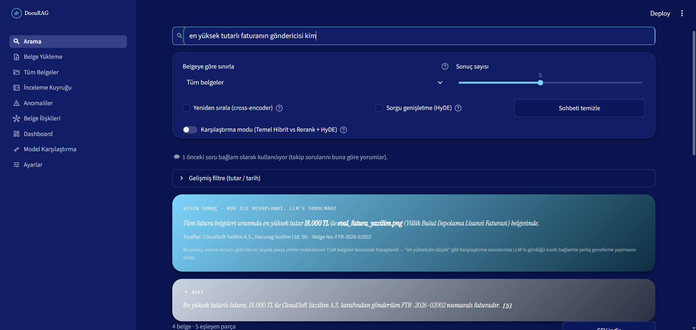
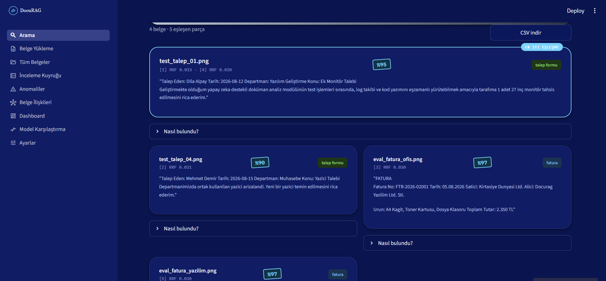
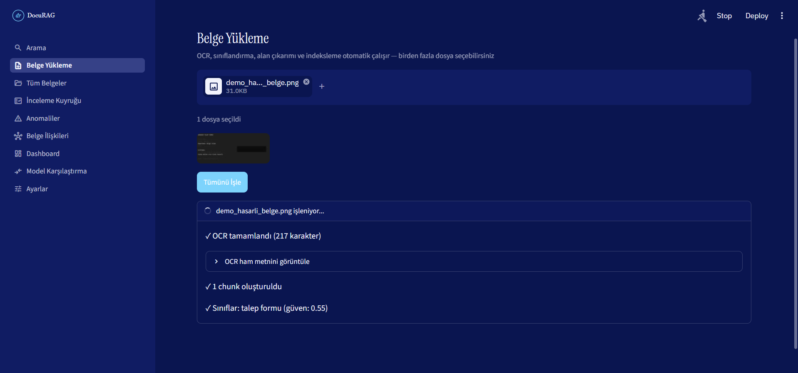
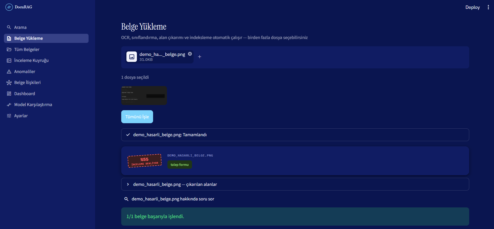
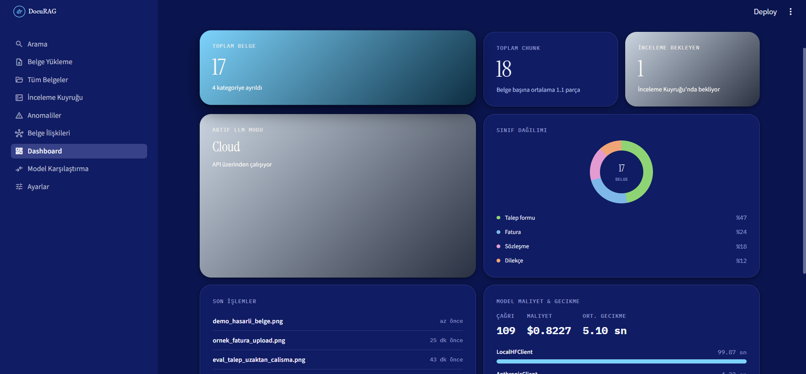
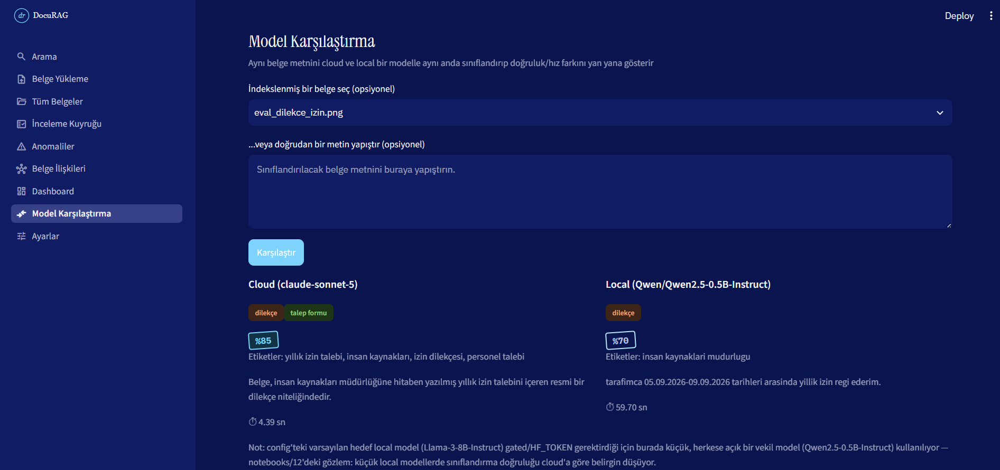
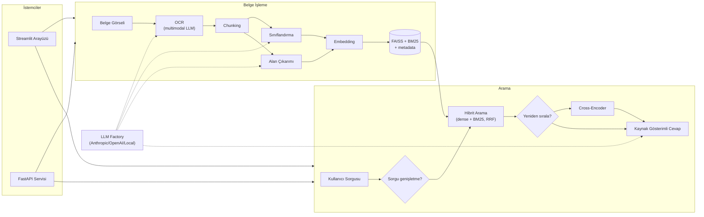

# DocuRAG


   

**Taranmış belgeleri okuyup anlayan, günlük konuşma diliyle sorulan sorulara kaynak göstererek cevap veren bir RAG (Retrieval-Augmented Generation) sistemi.**

Bir şirkette çalışanlar sürekli kağıt form dolduruyor: izin dilekçesi, fatura, sözleşme, donanım talebi... Bunlar taranıp görüntü olarak arşivleniyor ama biri "geçen ay kim laptop istedi?" diye sorduğunda yüzlerce görseli tek tek açmaktan başka çare kalmıyor.

DocuRAG bunu çözüyor. Her belgeyi önce "okuyor" (multimodal OCR), otomatik kategoriye ayırıp içinden tarih/tutar/taraflar gibi somut bilgileri çıkarıyor, sonra bunu öyle bir şekilde saklıyor ki kullanıcı sorudaki kelimeler belgede birebir geçmese bile en alakalı belgeyi buluyor ve **kaynağını göstererek** doğrulanmış bir cevap üretiyor. Sistem hem bulutta (Anthropic/OpenAI) hem bilgisayarda yerel çalışan modeller arasında tek bir ayardan geçiş yapabiliyor.

## Ekran Görüntüleri

| | |
|---|---|
|  **Kod ile doğrulanmış kesin cevap** — "en yüksek tutarlı fatura kimden geldi" gibi karşılaştırma soruları LLM'e tahmin ettirilmiyor; tüm belgeler taranıp gerçek cevap hesaplanıyor. |  **Şeffaf arama** — her sonucun hangi belgeden geldiği ve hangi skorla bulunduğu açıkça gösteriliyor. |
|  **Canlı işleme akışı** — OCR → sınıflandırma → alan çıkarımı → indeksleme adımları gerçek zamanlı izlenebiliyor. |  **İnsan-döngüde inceleme** — güveni düşük belgeler otomatik olarak onaya düşüyor. |
|  **Gerçek verilerle dolu Dashboard** — belge/kategori dağılımı, model maliyeti ve gecikmesi. |  **Cloud vs Local karşılaştırma** — aynı belge iki modelle sınıflandırılıp fark canlı gösteriliyor. |

## Mimari



Streamlit arayüzü ve FastAPI servisi birbirinden bağımsız çalışır; ikisi de aynı Python katmanını (`src/`) sarar. Hangi dil modelinin (cloud/local) kullanılacağı tek bir ayar dosyasından belirlenir, geri kalan koda dokunulmaz.

## Öne Çıkan Özellikler

**Belge anlama**
- Multimodal OCR ile taranmış görsellerden yapılandırılmış metin çıkarımı.
- Otomatik çoklu-kategori sınıflandırma (fatura/sözleşme/dilekçe/talep formu); güven skoru düşük çıkan belgeler otomatik olarak insan incelemesine düşer. Eşik değeri, gerçek API sonuçlarıyla ölçülüp kalibre edildi.
- Tarih, tutar, taraflar, belge numarası gibi somut alanların çıkarımı — "tutarı 1000-5000 TL arası olan belgeler" gibi filtreli aramaları mümkün kılar.

**Arama ve cevaplama**
- Anlam bazlı (embedding) ve anahtar kelime bazlı (BM25) aramayı birleştiren hibrit retrieval — aranan kelime belgede birebir geçmese de doğru sonucu bulur.
- Kaynak gösterimli cevaplama: üretilen her cümle, hangi belgeden geldiğini gösteren tıklanabilir bir numarayla işaretlenir ve bu kaynağın gerçekten geçerli olduğu **kod tarafında** doğrulanır — modele güvenilmez.
- "En yüksek tutarlı fatura hangisi" gibi karşılaştırma soruları LLM'e bırakılmaz; tüm belgeler taranarak cevap deterministik biçimde hesaplanır.
- Bir kaynağa tıklanınca, ilgili bilginin belge görselindeki yaklaşık konumu kutuyla işaretlenir.
- İsteğe bağlı sorgu genişletme (belirsiz sorguları zenginleştirme) ve cross-encoder ile yeniden sıralama.

**Belge zekası**
- Tekrarlanan belge numaraları ve istatistiksel olarak sıra dışı tutarlar, LLM çağırmadan, kural tabanlı olarak tespit edilir.
- Ortak taraf paylaşan belgeler arasındaki ilişkiler bir grafikte görselleştirilir.
- İnsan tarafından yapılan düzeltmeler kayıt altına alınıp isteğe bağlı olarak gelecekteki sınıflandırmalara örnek olarak beslenebilir.

**Çoklu model desteği**
- Tek bir ayardan Anthropic/OpenAI (cloud) veya bilgisayarda çalışan bir model (local) arasında geçiş — kod değişmez.
- Aynı belgeyi iki farklı modelle sınıflandırıp doğruluk/hız farkını yan yana gösteren karşılaştırma sayfası.
- Her model çağrısının süresi ve tahmini maliyeti kaydedilip Dashboard'da izlenebilir.

**Güvenlik ve mühendislik kalitesi**
- Belgeden gelen güvenilmeyen metin açıkça işaretlenir; altı farklı gerçek saldırı denemesi (talimat geçersiz kılma, sahte "gizli talimat", sistem promptu sızdırma) test edildi, hepsi başarısız oldu.
- LLM çıktısı serbest metin + regex yerine sağlayıcının kendi şema-zorlama mekanizmasıyla (structured output) alınır.
- 252 otomatik test, %90 kod kapsamı; her push'ta CI üzerinden testler, lint (ruff) ve tip denetimi (mypy) otomatik çalışır.
- Aynı veriye birden fazla servisin eşzamanlı yazması dosya kilidiyle güvenli hale getirildi.
- API katmanı Prometheus metrikleriyle izlenebilir.

## Ölçülmüş Sonuçlar

Sistem küçük bir örneklemde değil, kasıtlı olarak büyütülmüş ve çeşitlendirilmiş bir veri setinde test edildi:

- Değerlendirme seti 5 belge/1 kategoriden 15 belge/5 kategoriye çıkarıldığında Hit@1 %80'den %67'ye düştü — küçük ve tek tip bir örneklemin ne kadar iyimser sonuç verebildiğinin somut kanıtı.
- Üretilen cevapların kaynaklarına ne kadar sadık olduğu bağımsız bir değerlendirmeyle ölçüldü: ortalama sadakat skoru 0.96. Sistemin doğru belgeyi bulamadığı durumlarda ise (%17) uydurma bir cevap üretmek yerine sessiz kaldığı doğrulandı.
- Sınıflandırma güven eşiği, farklı senaryolardan (net belgeler, çok kategorili belgeler, kasıtlı belirsiz/hasarlı örnekler) oluşan bir kalibrasyon setiyle doğrulandı: net ve belirsiz örnekler arasında hiç örnek çıkmayan geniş bir boşluk var, eşik bu boşluğun ortasına oturuyor.

## Bilinen Sınırlar

- BM25, Türkçe'nin sondan eklemeli yapısına karşı kök/lemma bulma yapmıyor; bu, karışık kategorili bir veri setinde ölçülebilir bir doğruluk kaybına yol açıyor (yukarıya bakınız).
- Görsel vurgulama özelliği sistemde ayrıca kurulu bir Tesseract-OCR gerektirir; kurulu değilse özellik sessizce devre dışı kalır, geri kalan hiçbir şeyi etkilemez.
- Cevabın kademeli görünmesi gerçek bir canlı üretim (streaming) değildir, sadece okuma deneyimini yumuşatan bir gösterimdir.
- Çok-turlu (takip sorulu) arama, tarayıcı oturumuna özeldir.
- Prompt injection savunması istatistiksel olarak doğrulanmıştır, kod tarafında matematiksel bir garanti değildir.
- Yerel model karşılaştırmasında küçük model ilk kullanımda indirilir, bu birkaç dakika sürebilir.

## Proje Yapısı

```
app/              # Streamlit arayüzü (views/, styles.py, components.py) + api.py: bağımsız FastAPI servisi
config/           # Model ve vektör veritabanı ayarları
data/
  raw_docs/       # Örnek belge görselleri
  processed/      # Embedding, FAISS index ve değerlendirme raporları
notebooks/        # Geliştirme sürecinde kullanılan test defterleri
src/              # OCR, chunking, embedding, sınıflandırma, alan çıkarımı, hibrit arama,
                  #   sorgu genişletme, anomali tespiti, ilişki grafiği, kaynak gösterimli cevap
tests/            # Sahte istemcilerle çalışan, ağ çağrısı yapmayan pytest paketi
```

## Kurulum ve Çalıştırma

```bash
python -m venv venv
venv\Scripts\activate
pip install -r requirements.txt
```

`.env.example` dosyasını `.env` olarak kopyalayıp `ANTHROPIC_API_KEY` girin (OpenAI veya yerel bir model kullanılacaksa ilgili anahtar/ayar `config/settings.yaml`'dan ya da Ayarlar sayfasından yapılandırılabilir).

```bash
# Streamlit arayüzü
streamlit run app/app.py

# Bağımsız FastAPI servisi (opsiyonel)
uvicorn app.api:app --reload

# Komut satırından uçtan uca çalıştırma
python src/pipeline.py ingest data/raw_docs/test_talep_01.png
python src/pipeline.py search "laptop talebi"
```

Görsel vurgulama özelliği için (opsiyonel) sistemde ayrıca [Tesseract-OCR](https://github.com/tesseract-ocr/tesseract) + Türkçe dil paketi kurulu olmalı; kurulu değilse özellik sessizce devre dışı kalır.

## Testler

```bash
pip install -r requirements-dev.txt
pytest --cov=src --cov-report=term-missing
ruff check src app
mypy src --config-file mypy.ini
```

252 test, %90 kod kapsamı — hiçbiri gerçek API/ağ çağrısı yapmaz, hepsi sahte istemcilerle çalışır.
